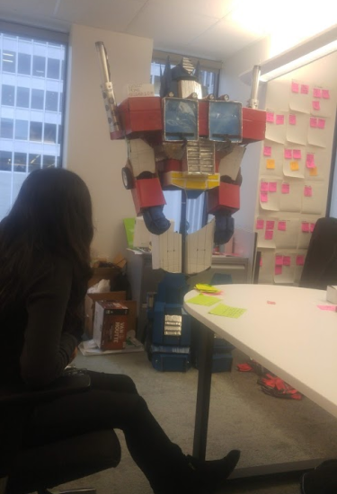

'We're gonna have to build Optimus Prime', said my boss. My first thought was - well, that wasn't in the job description. Second thought - ...why?

## No, really. Why?

A specific subset of VIA employees were undertaking a new project - one that I'm probably not allowed to talk about, so I'll spare you the details. They tapped our team to design and lead a workshop during this group's project launch. You know - a fun activity for the employees to get to know each other. Bonus points if they could walk away with a message of sorts. We didn't think much of it at first. We figured we would put together one of those classic icebreakers that everyone's done before. People would begrudgingly participate, go eat their catered food and call it a day.

But my boss had bigger plans. 

This particular project that was launching had an emphasis an agile approach to groupwork, which was not something people outside of VIA's IT team were super familiar with. To really drive home the point about collaboration and iterating upon a product before handing it over, the idea was to get our workshop participants to build something in a series of sprints. That 'something' wouldn't be revealed to them until they started putting all their parts together. And the big reveal at the end would be a product that they all contributed to and would (hopefully) be proud of. Sounds lovely - right?

Yeah. But before we told them how to build Optimus Prime, WE needed to build Optimus Prime. 

## Duct Tape, Cardboard, Spray Paint and Tears

Please note that I'm not a super 'hands-on' person. But for the few days where we put this project together, I became one. We essentially had to design Optimus from cardboard and various other materials, create templates out of these designs and then create one-pagers on how to put each of the parts together to make a whole. 

Naturally, we couldn't do this in the office, so our office for the next few days became my boss' garage. Through trial and error, Optimus was slowly coming together. 

          

That was the fun part. The boring part was putting together concise one-pagers that a lay-user could read from to put together the final product.

And this took almost as long as building Optimus himself. After all, we needed to design these one pagers for users who had no idea what they were building. As a result, we needed to be very careful with the terminology we used, and we also needed to ensure we weren't making any assumptions that could lead a potential user astray. A few wrong moves and the entire project could fall apart. 

For reference, here's what a sample one-pager looked like. This was was for the left calf. 

You'll notice we used part codes as to not give away what the users were building. We labelled each template with an appropriate part code so once a group of users completed one part of the sprint, they could hand off the part with the appropriate code to the next group for the next sprint.

It took a few revisions to get these one-pagers short yet informative, but in the end ... it was worth it. 

## The Final Product
Unfortunately, I don't have pictures of the day the workshop happened. There was so much going on - setting up the materials, organizing groups, setting up a kanban board with the one-pagers and so much more. However, the fruits of our labour were sweet. When we started off the workshop, there was a lot of confusion. People were a little disinterested, as typically a room of 30-50 year olds won't be super eager about what looks like arts and crafts. 

However, when individual parts started coming together, people started to engage more. There was a sense of urgency and teamwork and everyone pushed to get their components done in an effort to see what the final product was going to look like. 

And when people started to realize it was Optimus, there were lots of laughs. At this point, the surprise element was gone, but we actually still had 80-90% of the attendees working hard. 

Once the final components were assembled, they voted to put the project lead in the Optimus costume. Everyone signed off on the costume and took a group photo with Optimus - and that was the end of our time at the workshop. 

After all this reading, I figure you would want to see at least a part of the final product. Here's my co-worker in the Optimus arms. 

And here's Optimus hanging out in our office space temporarily. 

